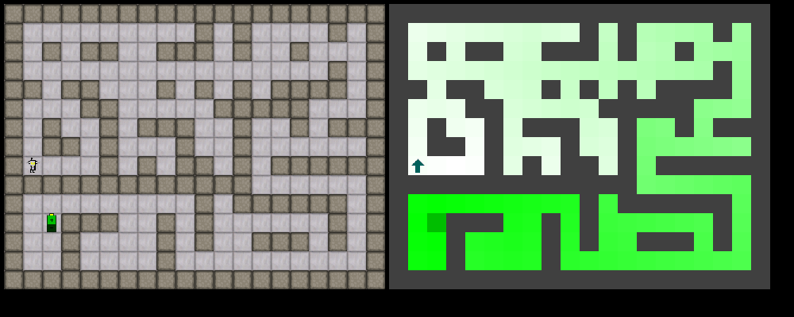

# Demonstrate interactional motivation with the Sniff Experiment

Execute `puzzle_game_interactional_motivation.py ai` to run the experiment.
The `ai` argument makes the agent controlled by the Interactional Motivation Schema Mechanism.

## Define the agent's possibilities of interaction 

The agent has 6 possible actions that may yield 5 possible outcomes:

| Code |  Action          |
|---|--------------------|
| 0 | sniff front         |
| 1 | move forward       |
| 2 | sniff left          |
| 3 | sniff right         |
| 4 | Turn left          |
| 5 | Turn right         |

| Code | Outcome  | Description |
|------|----------|-------------|
| 0    | decrease | The smell decreased. |
| 1    | stable   | The smell remained stable. |
| 2    | increase | The smell increased. |
| 3    | wall     | The agent bumped into a wall or sniffed a wall. |
| 4    | eat      | The agent reached and ate the target. |

The valences of interactions are defined as follows:

| Action       | Outcome   | Valence | Description                               |
|--------------|-----------|---------|-------------------------------------------|
| move forward | stable    |  10     | There was no smell or it remained stable. |
| move forward | wall      | -10     | The agent bumped into a wall.             |
| turn left    | stable    | -3      | Turned toward same smell.             |
| turn left    | decrease  | -3      | Turned toward weaker smell or wall |
| turn right   | stable    | -3      | Turned toward same smell.             |
| turn right   | decrease  | -3      | Turned toward weaker smell or wall |
| sniff front  | stable    | -1      | Sniff no smell or same in front
| sniff front  | wall      | -1      | Sniffed a wall in front | 
| sniff left   | stable    | -1      | Sniff no smell or same on the left |
| sniff left   | wall      | -1      | Sniffed a wall on the left |
| sniff right  | stable    | -1      | Sniff no smell or same on the right |
| sniff right  | wall      | -3      | Sniffed a wall on the right |
| move forward | decrease  | -1      | The smell decreased as the agent moved forward.  |
| move forward | increase  |  10     | The smell increased as the agent moved forward.  |
| move forward | eat       |  10     | The agent reached and ate the target.  |
| sniff front  | decrease  | -1      | The smell is weaker in front.  |
| sniff front  | increase  | -1      | The smell is stronger in front.  |
| sniff left   | decrease  | -1      | The smell is weaker on the left.  |
| sniff left   | increase  | -1      | The smell is stronger on the left.  |
| sniff right  | decrease  | -1      | The smell is weaker on the right.  |
| sniff right  | increase  | -1      | The smell is stronger on the right.  |

The agent initially ingnores the meaning of actions and outcomes. 
It has no knowledge that it exists in a two-dimensional grid with walls and a target emitting smell.

In short, the agent does not know what it is doing, but it knows whether it likes it or not!

It will learn to prefer behaviors that lead to positive-valence interactions, such as moving forward when the smell increases or reaching and eating the target. 
It learns nonetheless to use negative-valence "epistemic interactions" such as sniffing around to gather information about its environment.
Actions that lead to negative-valence interactions, such as bumping into walls or turning towards less smell, will be avoided over time.

## The demonstrations

Since the smell does not pass through walls, will eventually reach the target by ascending the smell gradient (represented by the gradiant of green in the right-hand screen).

### Beginning the development in the maze

This run was obtained with the commit [6bcaf25](https://github.com/PetiteIA/AIRIS_Public/commit/6bcaf25b03af0224f68f0bd1c5656db098d7845e).

Because the agent begins in the maze, it learns to sniff around to avoid bumpîng into walls before learning to move toward the target.

When it is put in the open grid, it keeps the habit of sniffing in front to avoid bumping into walls.

### Beginning the development in an open grid

This run was obtained with the commit [33f6fd2](https://github.com/PetiteIA/AIRIS_Public/commit/33f6fd244587dba6b26926d8bec7e87fe7d75353): same agent, different ordering of game levels.

Because the agent begins its development in a relatively open world, it quickly learns to approach and eat the target.

When the agent it put in the maze it suffer learning new behaviors to avoid bumping into walls.

## Conclusion

What interests us in this experiment is not particularly that the agent manages to reach the target. 
Of course it does because it likes the increase of smell.

But what is is more interesting is that it learns different kinds of behaviors depending on the training trajectory it undergoes.

Moreover, it learns to actively use "epistemic interactions" to avoid negative valence interactions (bumping into walls) even if these epistemic interactions have a negative valence themselves (sniffing around has a small negative valence).

## Tutorial

See the tutorial [IM_Tutorial_03.ipynb](IM_Tutorial_03.ipynb) for more technical explanations and to experience with differente valences of interactions.