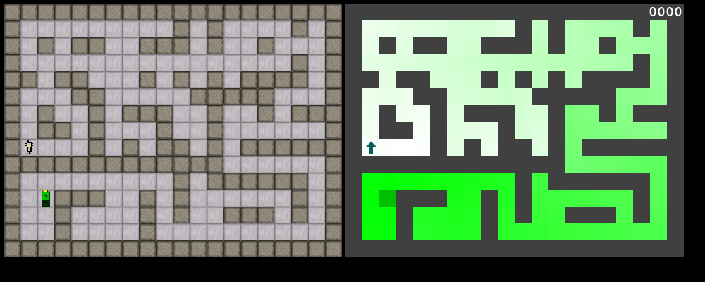
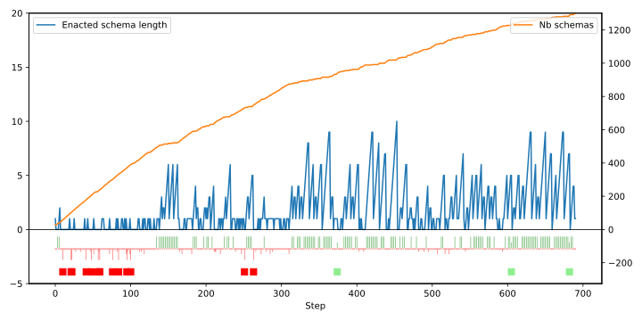
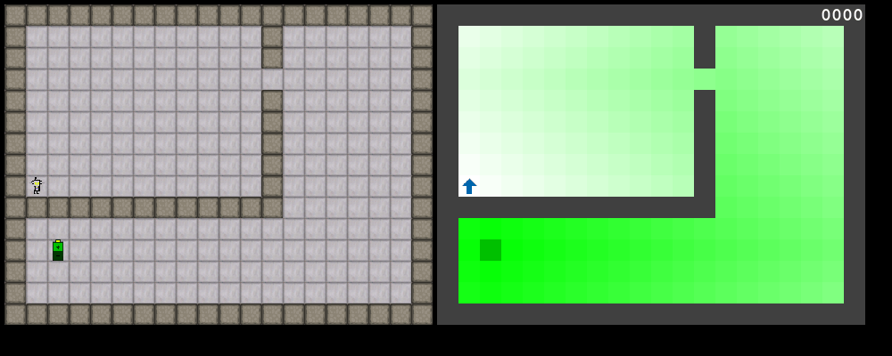
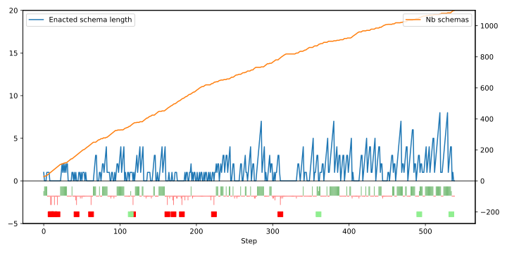

# Demonstrate interactional motivation with the Sniff Experiment

Execute `puzzle_game_interactional_motivation.py imo` to run the experiment.
The `imo` argument makes the agent controlled by the Interactional Motivation Schema Mechanism.

## Define the agent's possibilities of interaction 

The agent has 6 possible actions that may yield 5 possible outcomes:

| Code |  Action          |
|---|--------------------|
| 0 | sniff front         |
| 1 | move forward       |
| 2 | sniff left          |
| 3 | sniff right         |
| 4 | Turn left          |
| 5 | Turn right         |

| Code | Outcome  | Description |
|------|----------|-------------|
| 0    | decrease | The smell decreased. |
| 1    | stable   | The smell remained stable. |
| 2    | increase | The smell increased. |
| 3    | wall     | The agent bumped into a wall or sniffed a wall. |
| 4    | eat      | The agent reached and ate the target. |

The valences of interactions are defined as follows:

| Action       | Outcome   | Valence | Description                               |
|--------------|-----------|---------|-------------------------------------------|
| move forward | stable    |  10     | There was no smell or it remained stable. |
| move forward | wall      | -10     | The agent bumped into a wall.             |
| turn left    | stable    | -3      | Turned toward same smell.             |
| turn left    | decrease  | -3      | Turned toward weaker smell or wall |
| turn right   | stable    | -3      | Turned toward same smell.             |
| turn right   | decrease  | -3      | Turned toward weaker smell or wall |
| sniff front  | stable    | -1      | Sniff no smell or same in front
| sniff front  | wall      | -1      | Sniffed a wall in front | 
| sniff left   | stable    | -1      | Sniff no smell or same on the left |
| sniff left   | wall      | -1      | Sniffed a wall on the left |
| sniff right  | stable    | -1      | Sniff no smell or same on the right |
| sniff right  | wall      | -3      | Sniffed a wall on the right |
| move forward | decrease  | -1      | The smell decreased as the agent moved forward.  |
| move forward | increase  |  10     | The smell increased as the agent moved forward.  |
| move forward | eat       |  10     | The agent reached and ate the target.  |
| sniff front  | decrease  | -1      | The smell is weaker in front.  |
| sniff front  | increase  | -1      | The smell is stronger in front.  |
| sniff left   | decrease  | -1      | The smell is weaker on the left.  |
| sniff left   | increase  | -1      | The smell is stronger on the left.  |
| sniff right  | decrease  | -1      | The smell is weaker on the right.  |
| sniff right  | increase  | -1      | The smell is stronger on the right.  |

The agent initially ignores the meaning of actions and outcomes. 
It has no knowledge that it exists in a two-dimensional grid with walls and a target emitting smell.

In short, the agent does not know what it is doing, but it knows whether it likes it or not!

It will learn to prefer behaviors that lead to positive-valence interactions, such as moving forward when the smell increases or reaching and eating the target. 
It learns nonetheless to use negative-valence "epistemic interactions" such as sniffing around to gather information about its environment.
Actions that lead to negative-valence interactions, such as bumping into walls or turning towards less smell, will be avoided over time.

## The demonstrations

Since the smell does not pass through walls, the agent will eventually reach the target by ascending the smell gradient (represented by the gradiant of green in the right-hand screen).

### Developmental learning starting in the maze

This run was obtained with the commit [426572f](https://github.com/PetiteIA/AIRIS_Public/commit/426572f9d930b5309bb7b1555c345132387fa204).

_Video 1: Example run learning the "vigilant behavior"_

Because the agent begins in the maze, it learns to sniff around to avoid bumping into walls before learning to move toward the target.
We call this habit of sniffing in front to avoid bumping the "vigilant behavior".

When it is put in the open grid, it keeps the vigilant behavior.

_Figure 1: Trace of the example run shown in Video 1. Red squares: bump. Green squares: eat. 
On step 453, the agent successfully completed the re-enaction of a 10-step schema._

### Developmental learning starting in the open grid

This run was obtained with the commit [2467ce5](https://github.com/PetiteIA/AIRIS_Public/commit/2467ce536e31766f91f595653b0f78956417a512): same agent, different ordering of game levels.

_Video 2: Example run learning the "bold behavior"._

Because the agent begins its development in a relatively open world, it quickly learns to approach and eat the target.
We call this habit the "bold behavior".

When the agent is put in the maze, it has difficulties learning new behaviors to avoid bumping into walls.
When it is put back in the open grid, it returns to the bold behavior that it learned at the beginning of its development.

_Figure 2: Trace of the example run shown in Video 2.
On Steps 519 and 529, the agent successfully completed the re-enaction of an 8-step schema._

## Conclusion

What interests us in this experiment is not particularly that the agent manages to reach the target. 
Of course, it does because it likes the increase of smell.

But what is more interesting is that it learns different kinds of behaviors depending on the training trajectory it undergoes (the "vigilant behavior" or the "bold behavior").

Moreover, it learns to actively use "epistemic interactions" to avoid negative-valence interactions (bumping into walls) even if these epistemic interactions have a negative valence themselves (sniffing around has a small negative valence).

Schemas can be seen as small programs that the agent learns and re-executes in the appropriate context.
Demonstrating a 10-step self-programming effect (as in Figure 1) constitutes an innovative result in itself. 

## Tutorial

See the tutorial [IM_Tutorial_03.ipynb](IM_Tutorial_03.ipynb) for more technical explanations and to try different valences of interactions.

## Discussion

Of course, if for any reason, there is a local maximum of smell, the agent will be stuck in it and will never reach the target.

This is when the agent will have to form an explicit goal representation of the target and learn to descend the gradient of smell to get around the local maximum.

This passage from instinctive behaviors to goal-directed behaviors will be our next topic of research.
