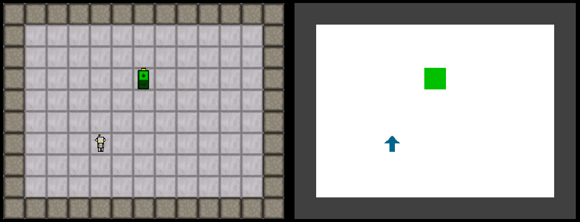

# puzzle_game_interactional_motivation.py

Execute `puzzle_game_interactional_motivation.py` to test the environment.

Use the following keys to control the agent (chosen for the numpad layout):

| Key |  Action          |
|---|--------------------|
| 1 | Feel left          |
| 2 | Feel front         |
| 3 | Feel right         |
| 4 | Turn left          |
| 8 | Move forward       |
| 6 | Turn right         |

Observe the outcome of actions in the console output:

| Code | Outcome                    | 
|------|----------------------------|
| 0    | Feel floor or Stable smell |
| 1    | Bump or Feel wall          |
| 2    | Smell increase left        |
| 3    | Smell increase right       |
| 4    | Smell increase front       |
| 5    | Smell decrease             |
| 6    | Target reached             |

See the tutorial [IM_Tutorial.ipynb](IM_Tutorial.ipynb)